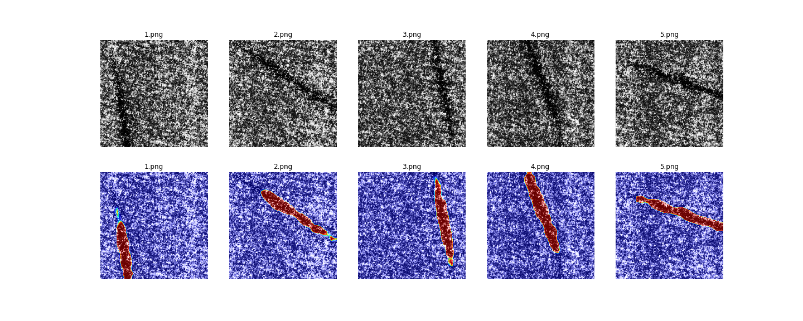

# Score-CAM

An implementation of [Score-CAM](https://arxiv.org/abs/1910.01279) with keras (tf.keras).

The following methods are compared.

- Grad-CAM
- Grad-CAM++
- Score-CAM
- Faster-Score-CAM (faster version of Score-CAM)

In addition, the followings are contained.

- Visualization of anomalous area for [**DAGM dataset**](https://resources.mpi-inf.mpg.de/conference/dagm/2007/prizes.html)
- Sample code for applying Score-CAM to your model.

Blog post: [Qiita](https://qiita.com/futakuchi0117/items/95c518254185ec5ea485)

# Faster Score-CAM

We thought that several channels were dominant in generating the final heat map. Faster-Score-CAM adds the processing of “use only channels with large variances as mask images” to Score-CAM. (`max_N = -1` is the original Score-CAM). 

When using VGG16, Faster-Score-CAM is about 10 times faster than Score-CAM.

# Requirement

- Python >= 3.6
- tensorflow >= 2.0

# Usage

See `Score-CAM.ipynb`.