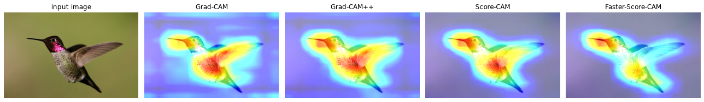
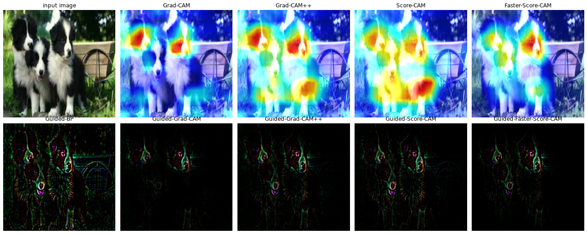
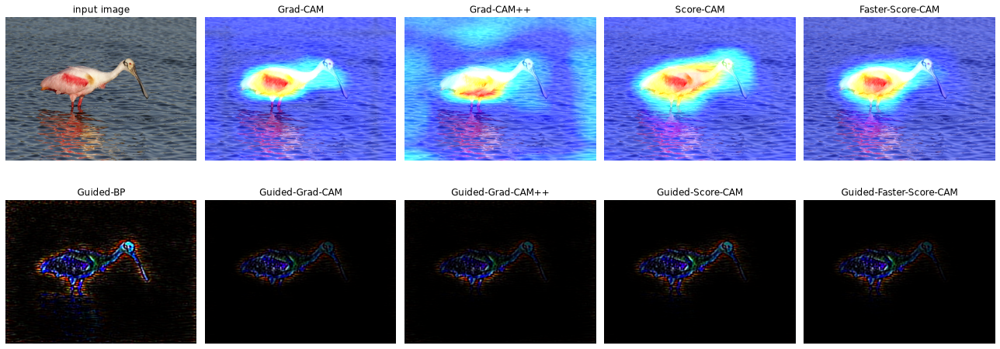
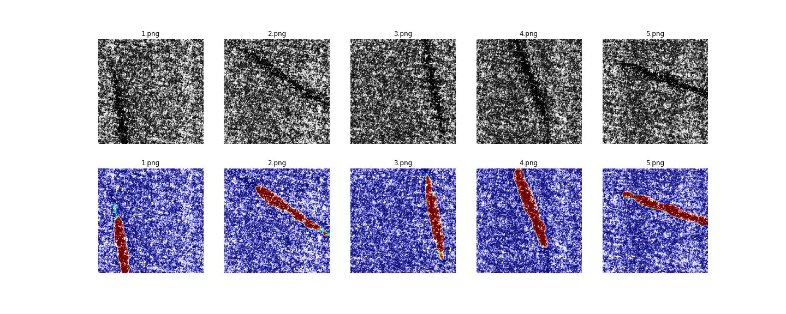

# Score-CAM

[](https://github.com/tabayashi0117/Score-CAM/actions/workflows/ci.yml)



A readable Keras implementation of [Score-CAM](https://arxiv.org/abs/1910.01279),
plus **Faster-Score-CAM**, a variant that is ~37x faster at a correlation of
0.93 with the full method.

The following are implemented and compared:

- [Grad-CAM](https://arxiv.org/abs/1610.02391)
- [Grad-CAM++](https://arxiv.org/abs/1710.11063)
- [Score-CAM](https://arxiv.org/abs/1910.01279)
- Faster-Score-CAM
- Guided Backpropagation, and the Guided-* combinations

Blog post: [Qiita](https://qiita.com/futakuchi0117/items/95c518254185ec5ea485) (Japanese)

## Install

```bash
git clone https://github.com/tabayashi0117/Score-CAM.git
cd Score-CAM
uv sync            # or: pip install -e .
```

Python >= 3.10, TensorFlow >= 2.16 (Keras 3). For an NVIDIA GPU on Linux,
`uv sync --extra gpu`, which pulls `tensorflow[and-cuda]`.

## Usage

```python
from keras.applications.vgg16 import VGG16, preprocess_input
from scorecam import ScoreCam, read_and_preprocess_img, superimpose

model = VGG16(include_top=True, weights="imagenet")
img_array = read_and_preprocess_img("./image/hummingbird.jpg", size=(224, 224))

cam = ScoreCam(model, img_array, "block5_conv3")               # Score-CAM
cam = ScoreCam(model, img_array, "block5_conv3", max_N=10)     # Faster-Score-CAM
overlay = superimpose("./image/hummingbird.jpg", cam)
```

Every CAM function returns a 2-D `float32` array scaled into `[0, 1]`, with the
spatial shape of the target layer, and takes an optional `class_index=` to
explain a class other than the model's top-1.

```python
from scorecam import GradCam, GradCamPlusPlus, GuidedBackPropagation, build_guided_model

GradCam(model, img_array, layer_name, class_index=None, use_logits=True)
GradCamPlusPlus(model, img_array, layer_name, class_index=None, use_logits=True)
ScoreCam(model, img_array, layer_name, max_N=-1, class_index=None, batch_size=32,
         weight_mode="reference", raw_img_array=None, preprocess_fn=None)
GuidedBackPropagation(build_guided_model(model), img_array, layer_name)
```

For a model that is not VGG16, pass its own preprocessing:

```python
from keras.applications.resnet50 import preprocess_input as resnet_preprocess_input

img_array = read_and_preprocess_img(path, preprocess_fn=resnet_preprocess_input)
```

See [`Score-CAM.ipynb`](./Score-CAM.ipynb) for the full walkthrough, including
applying Score-CAM to your own model.

## Faster-Score-CAM

Score-CAM runs one forward pass per channel of the target layer — 512 of them
for VGG16's `block5_conv3`. We found that a few channels dominate the final
heatmap, so Faster-Score-CAM keeps only the `max_N` activation maps with the
largest variance and masks with those. `max_N=-1` is plain Score-CAM.

Measured on `image/hummingbird.jpg`, VGG16 `block5_conv3`, one CPU machine,
TensorFlow 2.21. Absolute times depend on the machine; the ratios do not.

| method | time | speed-up | correlation with full Score-CAM |
|---|---:|---:|---:|
| Grad-CAM | 0.20 s | — | — |
| Grad-CAM++ | 0.20 s | — | — |
| Guided Backpropagation | 0.20 s | — | — |
| **Score-CAM** | **18.4 s** | 1x | 1.000 |
| Faster-Score-CAM `max_N=100` | 3.77 s | 5x | 0.995 |
| Faster-Score-CAM `max_N=30` | 1.22 s | 15x | 0.981 |
| **Faster-Score-CAM `max_N=10`** | **0.49 s** | **37x** | **0.932** |
| Faster-Score-CAM `max_N=3` | 0.24 s | 76x | 0.621 |
| Faster-Score-CAM `max_N=1` | 0.17 s | 108x | 0.538 |

`max_N=10` is the sweet spot: 37x faster for a correlation of 0.93. Below it the
map degrades quickly — `max_N=3` is already down to 0.62. Reproduce the table
with the "processing time" cells of the notebook.

## The paper and the authors' code disagree

The authors' [reference implementation](https://github.com/haofanwang/Score-CAM)
diverges from Algorithm 1 of their own paper in two places. Both are keyword
arguments here, documented inline in
[`scorecam/score_cam.py`](./scorecam/score_cam.py).

| | Algorithm 1 | reference implementation | this repo's default |
|---|---|---|---|
| mask target | the raw image `X₀` | the preprocessed tensor | preprocessed (pass `raw_img_array=` + `preprocess_fn=` for the paper) |
| channel weight | softmax over **channels** of the target-class logits | softmax over **classes**, take the target probability | `weight_mode="reference"` (use `"paper"` for Algorithm 1) |

**The defaults follow the reference implementation, not the paper.** Algorithm 1
read literally is close to degenerate: it exponentiates raw logits, which on a
confident prediction concentrates nearly all the weight on a couple of channels.
On VGG16 / `block5_conv3` / `hummingbird.jpg`, where the 512 masked inputs
produce target-class logits spanning 1.29 to 20.54:

```
$ uv run python -m scorecam.diagnostics

weight_mode    largest    top-10    exp(H)
paper           82.9%     96.4%       2.5
reference        1.4%     13.5%     159.6
```

That is 2.5 effective channels out of 512 — Score-CAM reduces to "show the two
or three best channels". Presumably why the authors' own code does something
else. The two modes correlate at r=0.76.

Note that both modes are computed from **logits**. A Keras classifier usually
ends in a softmax, so the pre-v0.2 code — which applied its own softmax on top
of the model's output — applied it twice and flattened the weights to 487 of 512
effective channels, very nearly an unweighted mean of the activation maps. Torch
models emit logits, which is why the reference code gets this right with one
softmax.

## Results




More in [`result/`](./result). Regenerate them with:

```bash
uv run python scripts/regenerate_results.py
```

## Anomaly detection on the DAGM dataset

The notebook also trains a truncated ResNet50 on the
[DAGM 2007](https://resources.mpi-inf.mpg.de/conference/dagm/2007/prizes.html)
textures and localizes the defects with Faster-Score-CAM. The backbone is cut at
`conv3_block4_add`, whose 28x28 feature map is fine enough for these small
defects; `superimpose(..., emphasize=True)` makes the low-contrast maps legible.



> The DAGM figures in `result/Class*_result_*.png` were produced with v0.1 and
> have not been regenerated — they need the dataset and six retrained models.

## Development

```bash
uv sync --group dev
uv run nbstripout --install   # once: keeps notebook outputs out of git
uv run pytest                 # ~0.5 s, CPU only, no downloads
```

The test suite runs against a tiny randomly-initialised CNN, so it needs no
ImageNet weights and stays fast enough to run on every push. CI additionally
re-resolves dependencies and runs the suite against the newest TensorFlow on the
1st of each month — this repository was broken by a TensorFlow upgrade once and
that job exists so it does not happen silently again.

See [`CLAUDE.md`](./CLAUDE.md) for the invariants contributors are expected to
keep.

## Related

For a general-purpose, actively maintained saliency library, prefer
[`tf-keras-vis`](https://github.com/keisen/tf-keras-vis) (Keras) or
[`pytorch-grad-cam`](https://github.com/jacobgil/pytorch-grad-cam) (PyTorch).
This repository is a reference implementation meant to be read.

## License

[MIT](./LICENSE)
